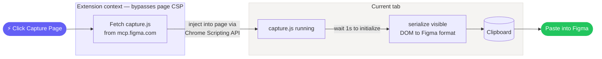

# URL to Figma

A free Chrome extension to capture any local or live URL and send it to Figma as an editable design. This operates with the same core features and fidelity that the paid Claude Code × Figma plug-in works.

**Free. No account. No third-parties.**

As of March 18, 2026, this works with any Figma account (free or paid), and in both the browser or desktop app. There is no authentication gate from Figma on this call. It does not call any third-parties (other than Figma itself).

---

<!-- TODO: Hero video — screen recording of the full flow end-to-end -->

## Install the Extension

> [!IMPORTANT]
> This is a developer install — it takes about 30 seconds.

**1. Get the files**
Clone or download this repo to your computer.
 
**2. Open Chrome extensions**
Navigate to `chrome://extensions` in Chrome.

**3. Enable Developer mode**
Toggle on **Developer mode** in the top-right corner of the page.

**4. Load the extension**
Click **Load unpacked**, then select the `extension/` folder from this repo.

**5. Pin it**
Click the puzzle piece icon in the Chrome toolbar and pin ⚡ URL to Figma so it's always one click away.

---

## How to Use

**TLDR:** Click ⚡ in your toolbar → click "Capture Page" → paste in Figma

**1. Navigate to any page**
Open whatever you want to capture — a live site or a local HTML/build.

**2. Click the ⚡ icon**
It's in your Chrome toolbar. The popup opens.

**3. Click "Capture Page"**
The extension fetches and injects the capture script, then captures the full page automatically. You can watch the status update in real time.

**4. Paste into Figma**
Open Figma and paste (`Cmd + V` on Mac, `Ctrl + V` on Windows). You'll get real, editable Figma frames — not an image.

<!-- TODO: Screen recording of the full flow end-to-end -->

---

## What to Expect

The popup shows live status as the capture runs:

| Status | What's happening |
|--------|-----------------|
| Fetching script… | Downloading Figma's capture script from `mcp.figma.com` |
| Injecting into page… | Loading the script into the current tab |
| Click "Copy to clipboard" on the page bar | Script is running — one click on the page is required to finish (see below) |

Once you click "Copy to clipboard" on the page bar, open Figma and paste.

> [!NOTE]
> **Why is one click still required?** Browsers only allow clipboard writes in direct response to a user gesture on the page itself — a click inside the extension popup doesn't count. Figma's capture bar handles this by giving you a "Copy to clipboard" button to click, which provides that gesture. This is a browser security requirement and can't be bypassed.

If something goes wrong, the status will tell you why:

| Error | Cause |
|-------|-------|
| Could not reach Figma servers | Network issue, or `mcp.figma.com` is temporarily down |
| Cannot inject into this page | Chrome internal pages (`chrome://`) can't be captured |
| Figma API unavailable — try reloading the page | The script didn't initialize in time; reload and try again |

---

## Which Sites Work

The extension fetches Figma's capture script from within the extension context — not from the page itself. This means it bypasses the Content Security Policy (CSP) restrictions that block the console script method on many sites.

| | Examples |
|---|---------|
| **Tends to work** | Most sites, including many that block the console method: marketing sites, portfolios, docs, SaaS apps |
| **Cannot capture** | Chrome internal pages (`chrome://`), other extension pages |

---

## How It Works

The key detail: because the fetch runs in the extension's own context rather than the page's, it sidesteps Content Security Policy restrictions that would block the same request from the browser console on many sites.

### What gets sent where
- **The script itself** is fetched from Figma's servers (`mcp.figma.com`). This is a one-time download per capture.
- **Your page content stays local.** The DOM capture is serialized and copied to your clipboard. Nothing is sent to any server.
- **When you paste into Figma**, that's when Figma processes the data — the same as pasting anything else into Figma.

---

## Tips & Limitations

- **Heavy pages might be slow.** The status will show "Capturing page…" until the page-side toolbar finishes. Give it a few seconds.
- **Fonts may not transfer.** Custom/local fonts may not render in Figma. Google Fonts usually work.
- **No interactivity.** You get static frames — no hover states, animations, or working buttons.
- **Clipboard permission.** Your browser may ask for clipboard access the first time.

<!-- TODO: Video walkthrough via Supercut (optional) -->

---

## Why I Made This

I've always been interested in HTML capture tools. 'Visbug' and 'Hover inspector like in Zeplin , Figma' are both daily drivers for me and helped bridge my design mind into development. Browsers already render everything, so it felt like the conversion to a design tool should be simpler than it is. Then, one night around 2 a.m., while tinkering with a Claude and Figma plugin, I discovered I could use a script to eliminate the need for session ID generation from Claude when transporting local HTML files to Figma files. Instead of going through Claude to send pages to Figma, I could inject the capture script directly into any page myself... Any live URL, not just local files.

I've been smoothing things out since then, and trying to not be overexcited to share with friends along the way (lol). I just love building things and finding better ways to get things done, and I'm always trying to make design/development tools more accessible. If you find ways to improve URL to Figma, let me know. Otherwise, check out the other stuff I'm working on.

<!-- TODO: Link to portfolio / other projects -->

---

## Disclaimer

This project is not affiliated with, endorsed by, or officially supported by Figma. It uses Figma's publicly hosted capture script (`capture.js`) at runtime. Use of this script is subject to [Figma's Terms of Service](https://www.figma.com/tos). Figma may change or remove access to this script at any time without notice.

## License

MIT
