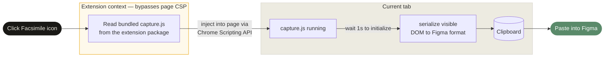

# Facsimile - URL to Design. 

## Copy any URL to Figma design layers.

[Website](https://facsimile.timgailey.com/)

A free Chrome extension to capture any local or live URL and send it to Figma as an editable design with layers intact. This operates with the same core features and fidelity that the Claude Code × Figma plug-in works, but without needing a Claude Code/AI subscription. This makes it handy for people who want to save Claude credits while working with HTML and Figma, or for those who want to capture a webpage or design into Figma. 

**Free.**

As of March 25, 2026, this works with any Figma account (free or paid), and in both the browser or desktop app. There is no authentication gate from Figma on this call. It does not call any third-parties (other than Figma itself).

---

[Watch the demo](https://supercut.ai/share/timgailey-design/81q-Iy88whU468KcVMUBMs)

## Install the Extension

> [!IMPORTANT]
> This is a developer install — it takes about 30 seconds.

**1. Get the files**
Clone or download this repo to your computer.

**2. Run the build script**
From the repo root, run `./build.sh`. This fetches Figma's `capture.js` and writes it to `extension/vendor/capture.js` so the extension can ship a self-contained copy. (The file isn't checked in — see the Disclaimer.)

**3. Open Chrome extensions**
Navigate to `chrome://extensions` in Chrome.

**4. Enable Developer mode**
Toggle on **Developer mode** in the top-right corner of the page.

**5. Load the extension**
Click **Load unpacked**, then select the `extension/` folder from this repo.

**6. Pin it**
Click the puzzle piece icon in the Chrome toolbar and pin Facsimile so it's always one click away.

---

## How to Use

**TLDR:** Click the Facsimile icon in your toolbar → capture starts automatically → paste in Figma

**1. Navigate to any page**
Open whatever you want to capture — a live site or a local HTML/build.

**2. Click the Facsimile icon**
It's in your Chrome toolbar. The popup opens and capture starts automatically.

**3. Paste into Figma**
Once the capture finishes and copies to your clipboard, open Figma and paste (`Cmd + V` on Mac, `Ctrl + V` on Windows). You'll get real, editable Figma frames — not an image.

<!-- TODO: Screen recording of the full flow end-to-end -->

---

## What to Expect

The popup shows live status as the capture runs:

| Status | What's happening |
|--------|-----------------|
| Preparing capture… | Loading the bundled `capture.js` from the extension package |
| Injecting into page… | Loading the script into the current tab |
| If the toolbar is spinning, click it to grant clipboard access | Script is running — see below |

> [!NOTE]
> **Why might a click still be required?** Browsers only allow clipboard writes in direct response to a user gesture on the page itself — a click inside the extension popup doesn't count. The first time you use Facsimile on a site, you may need to click the page toolbar to grant clipboard permission. After that, it works automatically.

If something goes wrong, the status will tell you why:

| Error | Cause |
|-------|-------|
| Could not load bundled capture script | Extension files are missing or unreadable — try reinstalling |
| Cannot inject into this page | Chrome internal pages (`chrome://`) can't be captured |
| Figma API unavailable — try reloading the page | The script didn't initialize in time; reload and try again |

---

## Which Sites Work

The extension ships Figma's capture script bundled inside the package and injects it into the page via the Chrome scripting API. Because the script is delivered by the extension rather than loaded by the page, it bypasses the Content Security Policy (CSP) restrictions that block the console-script method on many sites.

| | Examples |
|---|---------|
| **Tends to work** | Most sites, including many that block the console method: marketing sites, portfolios, docs, SaaS apps |
| **Cannot capture** | Chrome internal pages (`chrome://`), other extension pages |

---

## How It Works

The key detail: because the script is injected by the extension rather than loaded by the page, it sidesteps Content Security Policy restrictions that would block the same request from the browser console on many sites.

### What gets sent where
- **The script itself** is bundled inside the extension. No runtime download from `mcp.figma.com`. Refreshing it requires reinstalling a new version of the extension (or re-running `./build.sh` for developer installs).
- **Your page content stays local.** The DOM capture is serialized and copied to your clipboard. Nothing is sent to any server.
- **When you paste into Figma**, that's when Figma processes the data — the same as pasting anything else into Figma.

---

## Tips & Limitations

- **Heavy pages might be slow.** The status will show "Capturing page…" until the page-side toolbar finishes. Give it a few seconds.
- **Fonts may not transfer.** Custom/local fonts may not render in Figma. Google Fonts usually work.
- **No interactivity.** You get static frames — no hover states, animations, or working buttons.
- **Clipboard permission.** Your browser may ask for clipboard access the first time you capture on a site. Click the toolbar to grant it — after that, it works automatically.

<!-- TODO: Video walkthrough via Supercut (optional) -->

---

## Why I Made This

I've always been interested in HTML capture tools. 'Visbug' and 'Hover inspector like in Zeplin , Figma' are both daily drivers for me and helped bridge my design mind into development. Browsers already render everything, so it felt like the conversion to a design tool should be simpler than it is. And not just live URLs... local files too.

I'm always trying to make design/development tools more accessible. If you find ways to improve Facsimile, let me know. Otherwise, check out the other stuff I'm working on.

<!-- TODO: Link to portfolio / other projects -->

---

## Disclaimer

This project is not affiliated with, endorsed by, or officially supported by Figma. It uses Figma's publicly hosted capture script (`capture.js`), which is fetched at build time by `build.sh` and bundled into the extension package. The script itself is not redistributed via this git repository (`extension/vendor/` is gitignored). Use of this script is subject to [Figma's Terms of Service](https://www.figma.com/tos). Figma may change or remove access to this script at any time without notice.

## License

MIT
